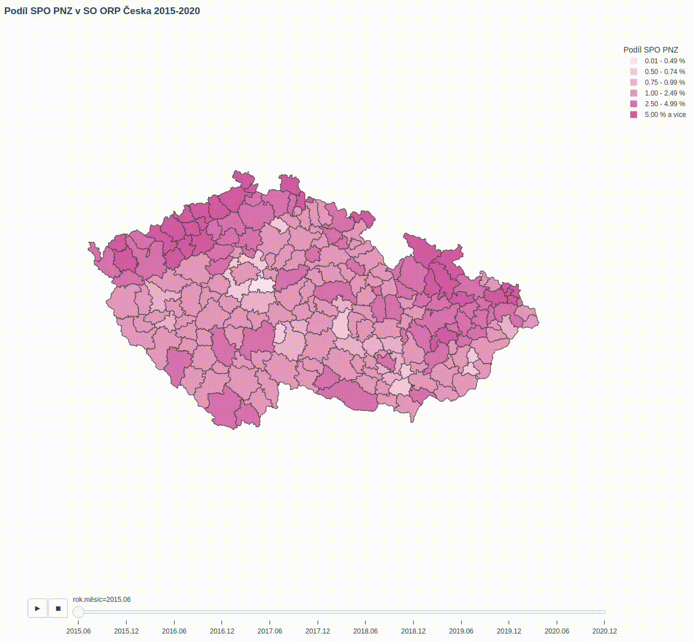

# GeoJson Map Animation
Project for Charles University & Czech Government

Showcase of how Czech citizens move over years 2015-2020 based on official data.

This project was done using Python's library plotly.express, geopandas and numpy.
